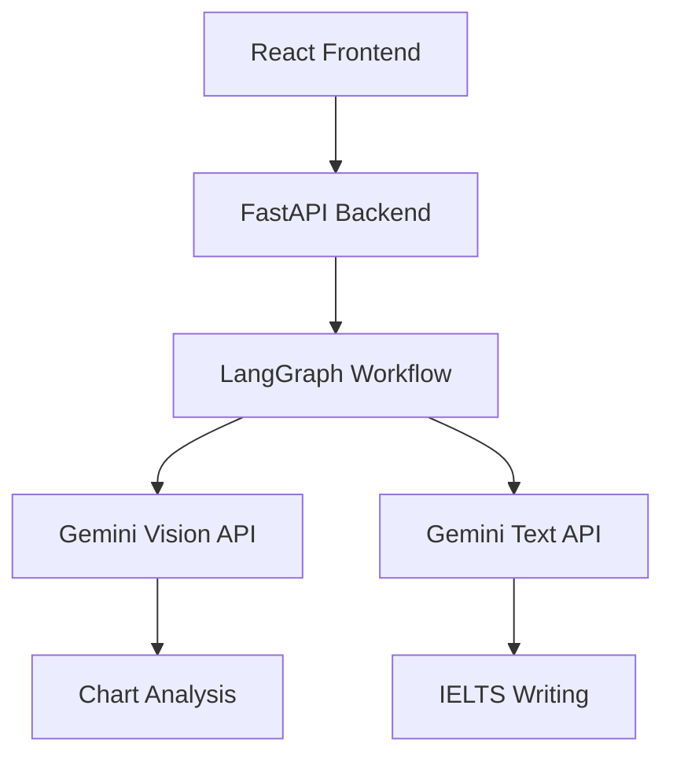

# IELTS Writing Task 1 AI Assistant

🤖 AI-powered IELTS Writing Task 1 analysis tool built with **FastAPI**, **React**, **LangGraph**, and **Gemini AI**.

Perfect for learning LangGraph workflow orchestration and AI-powered document analysis!

## ✨ Features

- 📊 **Chart Analysis**: Upload any chart/graph image and get detailed AI analysis
- ✍️ **IELTS Writing Generation**: Complete Writing Task 1 essays with proper structure
- 🔄 **LangGraph Workflow**: Multi-step AI processing with error handling
- 🎯 **Real-time Processing**: Live progress updates and streaming responses
- 📱 **Responsive UI**: Beautiful, modern interface built with React + Tailwind CSS
- 🔍 **Detailed Analysis**: Chart type detection, data extraction, trends, and comparisons

## 🏗️ Architecture



### LangGraph Workflow Steps:

1. **validate_input** - Input validation
2. **analyze_chart** - Chart image analysis with Gemini Vision
3. **process_data** - Data structuring and enhancement
4. **generate_writing** - IELTS essay generation
5. **finalize_result** - Result formatting and validation

## 🚀 Quick Start

### Prerequisites

- Python 3.8+
- Node.js 16+
- Gemini API Key from [Google AI Studio](https://makersuite.google.com/app/apikey)

### Backend Setup

1. **Install dependencies**:

```bash
pip install -r requirements.txt
```

2. **Set environment variables**:

```bash
# Create .env file
echo "GEMINI_API_KEY=your_gemini_api_key_here" > .env
```

3. **Run the FastAPI server**:

```bash
# Development mode with auto-reload
uvicorn app.main:app --reload --host 0.0.0.0 --port 8000

# Or run directly
python -m app.main
```

The API will be available at `http://localhost:8000`

### Frontend Setup

1. **Navigate to frontend directory**:

```bash
cd frontend
```

2. **Install dependencies**:

```bash
npm install
```

3. **Start development server**:

```bash
npm start
```

The app will open at `http://localhost:3000`

## 📋 API Endpoints

### Health Check

```http
GET /health
```

Check API and service status.

### Analyze IELTS Task

```http
POST /analyze
Content-Type: multipart/form-data

task_description: string
chart_image: file
```

### Alternative JSON Endpoint

```http
POST /analyze-json
Content-Type: application/json

{
  "task_description": "string",
  "image_base64": "string"
}
```

### Workflow Information

```http
GET /workflow-info
```

Get LangGraph workflow details.

## 🔧 Configuration

### Environment Variables

Create a `.env` file in the root directory:

```env
# Required: Gemini API Key
GEMINI_API_KEY=your_gemini_api_key_here

# Optional: Custom API URL for frontend
REACT_APP_API_URL=http://localhost:8000
```

### Supported Image Formats

- JPEG, PNG, GIF, WebP
- Max file size: 10MB
- Recommended: Clear, high-resolution charts

## 🧠 Learning LangGraph

This project demonstrates key LangGraph concepts:

### 1. **State Management**

```python
class IELTSWorkflowState(TypedDict):
    task_description: str
    image_base64: str
    chart_analysis: Dict[str, Any]
    ielts_writing: Dict[str, Any]
    error: str
    processing_step: str
```

### 2. **Node Functions**

```python
def analyze_chart_node(self, state: IELTSWorkflowState) -> IELTSWorkflowState:
    # Process chart image with Gemini Vision
    chart_analysis = self.gemini_service.analyze_chart_image(...)
    state["chart_analysis"] = chart_analysis
    return state
```

### 3. **Conditional Routing**

```python
workflow.add_conditional_edges(
    "validate_input",
    self.should_continue_after_validation,
    {
        "continue": "analyze_chart",
        "error": "handle_error"
    }
)
```

### 4. **Error Handling**

```python
def handle_error_node(self, state: IELTSWorkflowState) -> IELTSWorkflowState:
    print(f"❌ Error occurred: {state.get('error')}")
    return state
```

## 📊 Chart Scanning Methods

The app uses **Gemini Vision API** for chart analysis:

### Advantages:

- ✅ Direct image understanding
- ✅ Accurate data extraction
- ✅ Handles various chart types
- ✅ No preprocessing required
- ✅ Understands context and labels

### Alternative Methods (for learning):

1. **OCR + Computer Vision**: Tesseract + OpenCV
2. **Specialized Libraries**: ChartOCR, PlotDigitizer
3. **Custom CNN Models**: Trained chart recognition
4. **Graph Neural Networks**: For structured data extraction

## 🎯 IELTS Writing Task 1 Structure

The AI generates essays following official IELTS format:

1. **Introduction** (25-30 words)
   - Paraphrase the task description
2. **Overview** (35-45 words)
   - 2-3 main trends/features
   - Most significant patterns
3. **Body Paragraphs** (80-100 words)
   - Detailed data description
   - Specific figures and comparisons
   - Logical grouping of information

### Scoring Criteria:

- **Task Achievement**: Addresses all requirements
- **Coherence & Cohesion**: Logical organization
- **Lexical Resource**: Varied vocabulary
- **Grammar**: Range and accuracy

## 🛠️ Development

### Project Structure

```
ielts-writing-agent/
├── app/                    # FastAPI backend
│   ├── main.py            # Main application
│   ├── models/            # Pydantic schemas
│   ├── services/          # LangGraph + Gemini
│   └── utils/             # Utilities
├── frontend/              # React frontend
│   ├── src/
│   │   ├── components/    # React components
│   │   ├── services/      # API calls
│   │   └── App.js         # Main app
│   └── package.json
└── requirements.txt       # Python dependencies
```

### Adding New Features

1. **New Analysis Types**: Extend `ChartType` enum
2. **Custom Prompts**: Modify Gemini service prompts
3. **Additional Workflows**: Create new LangGraph nodes
4. **UI Components**: Add React components in `frontend/src/components/`

## 🧪 Testing

### Backend Testing

```bash
# Install test dependencies
pip install pytest pytest-asyncio

# Run tests
pytest
```

### Frontend Testing

```bash
cd frontend
npm test
```

### Manual Testing

1. Upload sample charts from IELTS practice materials
2. Test different chart types (bar, line, pie, table)
3. Verify word count and essay structure
4. Check error handling with invalid inputs

## 🚀 Deployment

### Backend (FastAPI)

```bash
# Production server
pip install gunicorn
gunicorn app.main:app --host 0.0.0.0 --port 8000
```

### Frontend (React)

```bash
cd frontend
npm run build
# Serve build/ directory with nginx or similar
```

### Docker (Optional)

```dockerfile
# Dockerfile example for backend
FROM python:3.9
WORKDIR /app
COPY requirements.txt .
RUN pip install -r requirements.txt
COPY . .
CMD ["uvicorn", "app.main:app", "--host", "0.0.0.0", "--port", "8000"]
```

## 📚 Learning Resources

### LangGraph

- [Official Documentation](https://langchain-ai.github.io/langgraph/)
- [LangGraph Tutorials](https://langchain-ai.github.io/langgraph/tutorials/)

### IELTS Writing Task 1

- [Official IELTS Guide](https://www.ielts.org/for-test-takers/test-format/writing-test-format)
- [Sample Essays](https://ieltsliz.com/ielts-writing-task-1-lessons-and-tips/)

### Gemini API

- [Google AI Studio](https://makersuite.google.com/)
- [Gemini API Documentation](https://ai.google.dev/)

## 🤝 Contributing

1. Fork the repository
2. Create feature branch (`git checkout -b feature/amazing-feature`)
3. Commit changes (`git commit -m 'Add amazing feature'`)
4. Push to branch (`git push origin feature/amazing-feature`)
5. Open Pull Request

## 📄 License

This project is for educational purposes. Please respect IELTS materials copyright and Google's API terms of service.

## 🎉 What You'll Learn

- **LangGraph**: Workflow orchestration, state management, conditional routing
- **AI Integration**: Multimodal AI, prompt engineering, error handling
- **Full-Stack Development**: FastAPI + React integration
- **IELTS Writing**: Academic writing structure and assessment criteria
- **Computer Vision**: Chart analysis and data extraction techniques

Happy learning! 🚀📚

---

Built with ❤️ for learning LangGraph and AI-powered document analysis.
