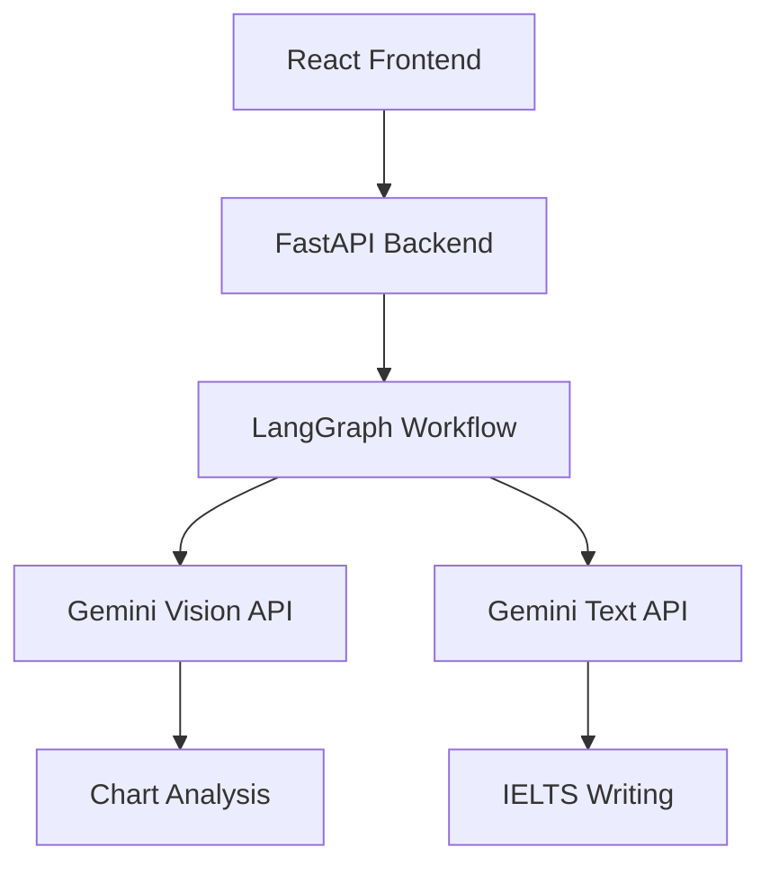

# IELTS Writing Task 1 AI Assistant

🤖 AI-powered IELTS Writing Task 1 analysis tool built with **FastAPI**, **React**, **LangGraph**, and **Gemini AI**.

Perfect for learning LangGraph workflow orchestration and AI-powered document analysis!

## ✨ Features

- 📊 **Chart Analysis**: Upload any chart/graph image and get detailed AI analysis
- ✍️ **IELTS Writing Generation**: Complete Writing Task 1 essays with proper structure
- 🔄 **LangGraph Workflow**: Multi-step AI processing with error handling

## 🏗️ Architecture



### LangGraph Workflow Steps:

1. **validate_input** - Input validation
2. **analyze_chart** - Chart image analysis with Gemini Vision
3. **process_data** - Data structuring and enhancement
4. **generate_writing** - IELTS essay generation
5. **finalize_result** - Result formatting and validation

## 🚀 Quick Start

### Prerequisites

- Python 3.8+
- Node.js 16+
- Gemini API Key from [Google AI Studio](https://makersuite.google.com/app/apikey)

### Backend Setup

1. **Install dependencies**:

```bash
pip install -r requirements.txt
```

2. **Set environment variables**:

```bash
# Create .env file
echo "GEMINI_API_KEY=your_gemini_api_key_here" > .env
```

3. **Run the FastAPI server**:

```bash
# Development mode with auto-reload
uvicorn app.main:app --reload --host 0.0.0.0 --port 8000

# Or run directly
python -m app.main
```

The API will be available at `http://localhost:8000`

### Frontend Setup

1. **Navigate to frontend directory**:

```bash
cd frontend
```

2. **Install dependencies**:

```bash
npm install
```

3. **Start development server**:

```bash
npm start
```

The app will open at `http://localhost:3000`

## 🔧 Configuration

### Environment Variables

Create a `.env` file in the root directory:

```env
# Required: Gemini API Key
GEMINI_API_KEY=your_gemini_api_key_here

# Optional: Custom API URL for frontend
REACT_APP_API_URL=http://localhost:8000
```

### Supported Image Formats

- JPEG, PNG, GIF, WebP
- Max file size: 10MB
- Recommended: Clear, high-resolution charts

## 🧠 Learning LangGraph

This project demonstrates key LangGraph concepts:

### 1. **State Management**

```python
class IELTSWorkflowState(TypedDict):
    task_description: str
    image_base64: str
    chart_analysis: Dict[str, Any]
    ielts_writing: Dict[str, Any]
    error: str
    processing_step: str
```

### 2. **Node Functions**

```python
def analyze_chart_node(self, state: IELTSWorkflowState) -> IELTSWorkflowState:
    # Process chart image with Gemini Vision
    chart_analysis = self.gemini_service.analyze_chart_image(...)
    state["chart_analysis"] = chart_analysis
    return state
```

### 3. **Conditional Routing**

```python
workflow.add_conditional_edges(
    "validate_input",
    self.should_continue_after_validation,
    {
        "continue": "analyze_chart",
        "error": "handle_error"
    }
)
```

## 🎯 IELTS Writing Task 1 Structure

The AI generates essays following official IELTS format:

1. **Introduction** (25-30 words)
   - Paraphrase the task description
2. **Overview** (35-45 words)
   - 2-3 main trends/features
   - Most significant patterns
3. **Body Paragraphs** (80-100 words)
   - Detailed data description
   - Specific figures and comparisons
   - Logical grouping of information

